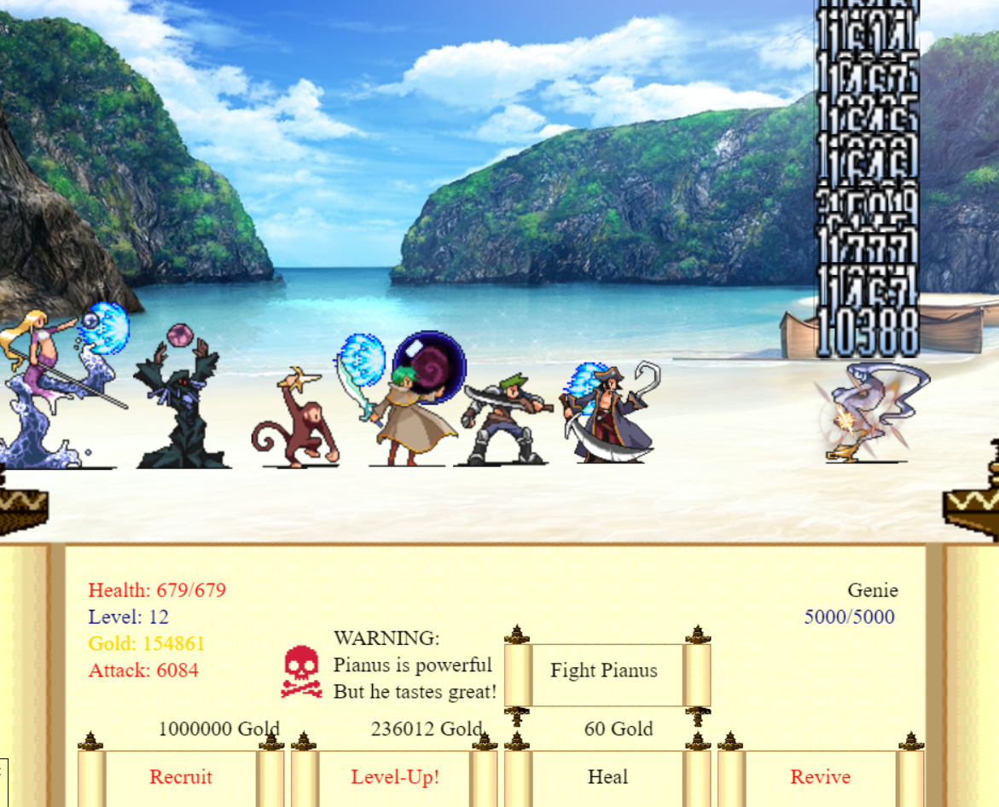

# mapleclicker.py
A clicker game written in Python, using the simplegui module. 

## Overview
This is an idle clicker game with goal to kill a big fish. There multiple characters with unique attacks and many enemies that can be unlocked. Written for a Programming 11 project. 


## Usage
There two ways to run the game.

### 1. **Running through CodeSkulptor**
Copy and paste the source code into [CodeSkulptor](codeskulptor.org) and run.

### 2. **Running locally**
1. Clone this repository:
```
git clone https://github.com/tawnyzhao/mapleclicker.py/
```

2. Install Pygame and SimpleGUICS2Pygame:

```
pip install Pygame
pip install SimpleGUICS2Pygame
```

3. Run mapleclicker.py

## Legal
Spritework is done by [Milano Cat](http://www.geocities.co.jp/Milano-Cat/)


